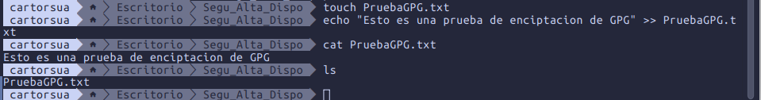
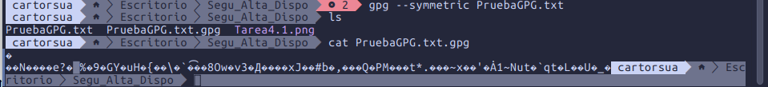
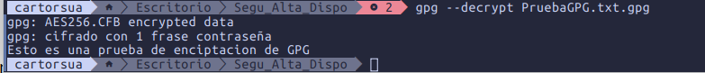

# Tarea 4
## 1. Crea un fichero de texto con un mensaje.

## 2. Utiliza la orden correspondiente para encriptarlo con cifrado simétrico, sin utilizar parámetros. Comprueba de qué tipo es el fichero que se ha generado (binario o de texto).

## 4. Utiliza el comando correspondiente para desencriptar el fichero. ¿El resultado se guarda en algún fichero?

si se crea un fichero txt al desencriptar

## 5. Vuelve a realizar el paso 2, pero en este caso asegúrate de que el fichero encriptado se guarda en un fichero de texto.

## 6. Haz una captura del contenido de dicho fichero.

## 7. Sube a Aules el enlace a la tarea en tu GitHub, asegurando el acceso al documento explicativo, así como a los ficheros creados (el original y los encriptados). Indica en el documento la contraseña que has utilizado para que el profesor pueda desencriptarlos.

contraseña del documento: Maurici0
